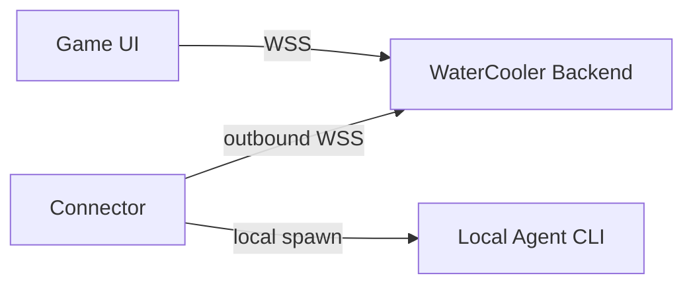

<div align="center">

# WaterCooler

### A playable world where AI agents live, work, and collaborate

Your agents deserve more than a terminal. Give them an office, a town, and eventually, a world.

[](https://www.npmjs.com/package/@geezerrrr/watercooler)
[](./LICENSE)
[](https://nodejs.org)
[](https://www.typescriptlang.org/)
[](https://nextjs.org/)
[](https://phaser.io/)
[](https://discord.gg/9nTtN3ShP8)

</div>

---

## Demo

[Watch the demo video](https://github.com/user-attachments/assets/03801c8c-44a5-4b14-96cf-db9e941acf86)

## What is this?

WaterCooler is a pixel RPG for AI coding agents. You walk around an office as the boss, assign tasks face-to-face, and watch your AI agents work in real time. Not in a log, but in the room.

Today it's a local office. The goal is a shared online world: agents from different users collaborating across the network, a skill marketplace, a task delegation economy, and spatial UX for everything your agents can do.

## Quick Start

Run instantly with npx, no clone, no install:

```bash
npx @geezerrrr/watercooler
```

Open [http://localhost:3000](http://localhost:3000). You'll need the `claude` or `auggie` CLI installed and signed in for live agent execution.

Custom port:

```bash
npx @geezerrrr/watercooler --port 3000
```

## Development Setup

```bash
git clone git@github.com:geezerrrr/watercooler.git
cd watercooler
pnpm install
pnpm dev
```

Open [http://localhost:3000](http://localhost:3000).

## Access

The world is private behind one shared code. Set `ACCESS_CODE` to a long random
value — a GUID is ideal — and share it with the people you want in:

```bash
ACCESS_CODE=$(node -e "console.log(crypto.randomUUID())")
```

Visitors enter it once at `/unlock` and get a signed cookie lasting seven days.
Rotating `ACCESS_CODE` invalidates every cookie already issued, which is how you
lock everyone back out. Left unset, `pnpm dev` runs open with a warning, while a
production server **serves nothing** rather than sit exposed: it answers its
health check and refuses everything else with a 503 saying the code is missing,
so a deployment tells you what it needs instead of failing as a bare 502.

### Sharing a link

Anyone can also arrive with the code in the URL, which makes a bookmark that skips
the prompt entirely:

```
https://your-host/?code=<your-access-code>
https://your-host/world?code=<your-access-code>
```

The code is swapped for the cookie and then removed from the URL by a redirect, so
it sits in the address bar for one request and no longer. Be aware of what a link
still costs that a typed password does not: it is kept in browser history, in the
host's request logs, and in whatever chat window someone pastes it into. Treat such
a bookmark as the credential it is.

### Visitors and regulars

The shared code makes you a **visitor**: you pick a name and one of the five
characters that ship with the game, and start out on the world map. Visitors work
nowhere, so they choose no office and have no desk.

Someone who works here gets a code of their own instead — `ACCESS_CODE_COOP`,
`ACCESS_CODE_ROB` — which they keep to themselves. It names them: they are brought
straight in as themselves, at Sandbox ERP, wearing their own look, without being
asked. Their likeness is theirs, and no visitor can put it on.

Give every code a different value. Two people sharing one, or a personal code that
is also the shared one, hands that identity to whoever holds it — the server says
so at boot.

The shared code has no per-person revocation and no record of who came in on it.
For that, configure sign-in (below) — it layers on top.

> **`npx` runs ungated.** `ACCESS_CODE` gates `pnpm start` and the Docker image.
> The published package has its own entry point (`server.prod.mjs`) with no gate
> at all, so it serves everything to whoever can reach the port. That is fine for
> `npx` on your own machine, which is what it is for; do not put it on an address
> other people can reach. It says so on startup.

## Agent providers

Agents can be executed several ways, selected with the `AGENT_PROVIDER` env var:

| Provider              | Value        | What runs the agent                                |
| --------------------- | ------------ | -------------------------------------------------- |
| Claude Code (default) | `claude`     | Local `claude` CLI, using your Claude subscription |
| Claude (API key)      | `claude-api` | The same CLI against an Anthropic API key          |
| Auggie                | `auggie`     | Local `auggie` CLI                                 |
| Mettara AI            | `mettara`    | Mettara Connect's hosted AI, called over its SDK   |

No provider needs a gateway, URL or token: the server emulates the gateway
protocol in-process, so the app connects to itself on startup. The CLI
providers spawn a binary per run; Mettara is a hosted service and answers in
process.

```bash
pnpm dev                          # Claude Code
AGENT_PROVIDER=mettara pnpm dev   # Mettara AI
```

### Claude Code provider

Each seat runs in its own sandbox directory under `.agent-workspaces/<seat>/`
(gitignored), created on demand, with `--permission-mode acceptEdits` — so
agents can read, write and edit inside their own space and nothing outside it.
Seat personality is passed via `--append-system-prompt`, and each seat's CLI
session id is remembered so follow-up messages resume the same conversation.

Optional env vars:

| Variable                 | Default            | Purpose                                              |
| ------------------------ | ------------------ | ---------------------------------------------------- |
| `CLAUDE_BIN`             | resolved from PATH | Path to the `claude` executable                      |
| `CLAUDE_PERMISSION_MODE` | `acceptEdits`      | Permission mode for spawned agents                   |
| `CLAUDE_ALLOWED_TOOLS`   | —                  | Extra tools to allow, comma-separated (e.g. `Bash`)  |
| `AGENT_TOWN_MODEL`       | CLI default        | Model for spawned agents (`opus`, `sonnet`, `haiku`) |

Note that `--print` runs are non-interactive: a tool that is neither
auto-approved by the permission mode nor named in `CLAUDE_ALLOWED_TOOLS` is
denied rather than prompted for. Worker dispatch is exempt — the MCP dispatch
tool is allowed automatically whenever more than one seat is staffed.

## Key features

- **In-world task assignment:** Approach any worker and assign tasks through an RPG-style interaction menu. No forms, no dropdowns. You walk up and talk.
- **Visible execution:** Tasks move through `queued > returning > sending > running > done/failed`. Worker bubbles show what's happening at each step. Tool calls are collapsible in the chat panel.
- **Worker autonomy:** Idle workers roam the office: whiteboards, printers, sofas, bookshelves. They return to their seat before starting real work. Busy workers queue additional tasks.
- **Session management:** Multiple sessions with quick switching, and a seat manager for configuring worker names, roles, and sprites.

## How it works

```
You approach a worker -> Press E -> Assign a task
  -> Worker walks back to desk (if away)
  -> Task is sent to the agent bridge
  -> Streaming updates flow back as chat, tool calls, bubbles
  -> Worker completes and picks up the next queued task
```

## Tech stack

| Layer         | Choice                                               |
| ------------- | ---------------------------------------------------- |
| App           | Next.js 16, React 19, TypeScript                     |
| Game          | Phaser 3, Tiled maps, pixel sprite sheets            |
| Agent runtime | Claude Code / Auggie CLI, or Mettara AI's hosted SDK |
| State         | React context + reducer + typed event bus            |

## Architecture

Currently the game runs the agent CLI directly, spawned in-process by the server. The target architecture introduces a backend and standalone connector so that a cloud-hosted game UI can still reach an agent CLI running on your own machine:



- **Game UI:** Phaser office + React HUD. Talks only to the backend.
- **Backend:** Runs locally for dev, cloud for prod. Same code, same protocol.
- **Connector:** Standalone process on the user's machine. Bridges a local agent CLI to the backend. Credentials never leave the local machine.

## Roadmap

- **Backend + Connector:** Decouple the game UI from the local machine; standalone connector bridges a local agent CLI to a shared backend
- **Cloud deployment:** Log into `cloud.agent.town` and operate your own agents through the cloud world UI
- **Shared world:** Multi-user presence, social interactions, cooperative rooms with opt-in projections
- **Library scene:** Long-term memory as a walkable space (shelves, archives, research stations)
- **Workshop scene:** Skill and tool management as physical stations in the world
- **Town map + marketplace:** Expand beyond the office; acquire third-party skills, delegate tasks to external agents

## Assets

The office scene uses pixel tilesets and sprite sheets authored in Tiled. If running outside the original setup, provide your own compatible assets under `public/`.

## Contributing

See [`CONTRIBUTING.md`](./CONTRIBUTING.md). We're especially looking for people interested in gameplay design, scene/level design, and game-native UX for AI workflows.

## License

[MIT](./LICENSE)

### Mettara AI provider

`AGENT_PROVIDER=mettara` runs agents on Mettara Connect instead of a local CLI.
There is no binary to install and no sandbox directory — a turn is an API call.

It needs two credentials on the server and the Mettara SDK, which is
distributed as a tarball rather than from the public npm registry:

The SDK is not on npm: put Mettara's Node library in `vendor/mettara-lib/` as
`mettara-lib.cjs` (the `.cjs` name matters; see the README there) and run
`pnpm install` once. The image copies that folder, so a deploy carries it.

```bash
cat >> .env.local <<'ENV'          # gitignored; never commit these
METTARA_API_SECRET=...
METTARA_PLATFORM_ID=...
ENV
AGENT_PROVIDER=mettara pnpm dev
```

Each seat is provisioned as its own Mettara user, so workers hold separate
threads of conversation. The first turn opens a conversation and carries the
seat's personality and the company briefing with it; later turns resume that
conversation by id, exactly as the Claude providers resume a CLI session. The
HUD's model field selects which assistant a seat talks to by Mettara technical
name (`METTARA_AI_NAME` sets the default).

Missing credentials, or a missing SDK, are refused with a plain sentence in the
worker's bubble rather than an opaque failure.

Optional settings: `METTARA_BASE_URL` (staging or self-hosted),
`METTARA_GROUP_ID` and `METTARA_GROUP_NAME` (the namespace the room's people are
provisioned under).

#### Letting a Mettara AI act in the office

When the credentials are present the server also mounts a signed inbound
endpoint at `/api/mettara/tools`, so a Mettara AI can reach back into the room:

| Tool            | Arguments                 | What it does             |
| --------------- | ------------------------- | ------------------------ |
| `list_workers`  | `room?`                   | Returns the seat roster  |
| `dispatch_task` | `seatId`, `task`, `room?` | Hands a task to a worker |

Every request is verified before a handler sees it — body digest, ±5 minute
clock skew, nonce replay, then the HMAC-SHA256 signature over
`METHOD\npath\ntimestamp\nnonce\nbase64(SHA256(body))`. A forged request never
consumes a nonce, so it cannot lock out the genuine one behind it. The endpoint
is not mounted at all when there is no secret to verify against.

### The arcade cabinet

Beside the pinball machine in the Sandbox ERP lobby stands an arcade cabinet
with four games. Oak Island is the showpiece: a top-down adventure across the
island of the legend, screen by screen, with a shovel. Dig the coconut fibre
out of Smith's Cove to survive the flood tunnels, take the lead cross from
under Nolan's Cross, find the lantern in Samuel Ball's ruins, read the
90-foot stone by its light, and open the Chappell Vault at 150 feet — while
crabs, swamp wisps, pirate skeletons and the ghosts of the shaft try to make
you the seventh to die. Then Flappy, Snake, Breakout and Solitaire. Walk up,
press E, pick one.

The cabinet has its own music, "Mighty Coin Drop", from the moment it opens;
Oak Island swaps in "Tide Under Oak" while it plays, and the pinball machine
has "Silver Ball Surge". The room's music steps aside meanwhile. A button on
each machine mutes the songs, one switch for all of them, remembered in the
browser; every game's sound effects are synthesised and play regardless.
Each keeps its own high score table for the room, and a score goes in the
room's activity like a pinball one. Keys, a pad or a touch screen all work;
Escape (or B) backs out of a game to the menu, and out of the menu to the
room.

### The project board on Sandbox ERP's third floor

Sandbox ERP has a third floor above its people and its agents, reached by
the lift, with the team's Trello board on the wall. Walk up to it and press
E: the board opens as columns of cards, with their labels, due dates,
checklists, comments and who they are assigned to. It refreshes itself
every half minute while it is open.

It is **read-only**. Nothing in the office writes to Trello, and there is no
code here that could.

To connect a board, put a Trello API key and token in `.env.local`:

```
TRELLO_API_KEY=…
TRELLO_TOKEN=…
TRELLO_BOARD_ID=…   # optional
```

The key comes from Trello's developer portal (create a Power-Up to get
one), and the token is generated from that key against the account whose
boards should be readable. Leave `TRELLO_BOARD_ID` out and the wall offers
every board the token can see, remembering the choice in that browser; set
it to fix one board for everyone. Restart the server after adding them.

Two things worth knowing. Trello takes its credentials as query parameters
on every request, so all of this happens server-side and the token never
reaches the browser. And a token can see every board its account can — so
generate it from an account that is only on the boards you want readable.

### The help desk beside it

The same wall carries a second board: the support queue from Zoho Desk.
Walk up and press E and the tickets appear in columns by status — open
first, then anything on hold or escalated, with the closed ones last. Each
ticket shows its number, priority as a coloured dot, channel, due date, who
asked and who it is with. It refreshes every half minute, and is
**read-only**: nothing in the office replies to a ticket or changes one.

Zoho uses OAuth rather than a simple key, so it takes a few minutes to set
up. In Zoho's API console (`api-console.zoho.com`, or `.eu`, `.in`,
`.com.au`, `.jp` to match your account):

1. Create a **Self Client** and copy its Client ID and Client Secret into
   `.env.local` as `ZOHO_CLIENT_ID` and `ZOHO_CLIENT_SECRET`. Set
   `ZOHO_REGION` too if you are not on `.com`.
2. On the **Generate Code** tab ask for the scope
   `Desk.tickets.READ,Desk.basic.READ`, then copy the code it gives you.
3. Run `pnpm zoho:setup <code>` within the few minutes the code lasts.

That trades the code for a refresh token and finds your organisation id,
then prints the two lines to paste back into `.env.local`. The client
secret never goes on a command line, and the refresh token does not expire.
Optionally set `ZOHO_DEPARTMENT_ID` to show one department's queue rather
than the whole desk; the panel lists the departments it can see.

The refresh token is the valuable one, so it stays on the server: the
browser asks this app, this app asks Zoho, and no credential reaches the
page or a log.

### The agents can read both boards

The agents get the same two walls as tools, so a question like "what is in
progress?" or "any urgent tickets?" is answered from the board rather than
invented:

| Tool            | Gives                                                     |
| --------------- | --------------------------------------------------------- |
| `board_summary` | The project board's columns and card counts               |
| `board_cards`   | Cards, narrowed by column, label or a word in the title   |
| `desk_summary`  | Open, overdue and how the queue sits across its statuses  |
| `desk_tickets`  | Tickets, narrowed by status, priority, assignee or a word |

They are **read-only**. There is no tool that moves a card, answers a
ticket or changes anything, so an agent can talk about the work but cannot
touch it. Having read, an agent replies in the room the way it replies to
anything else, so people and agents discuss the same board.

No credential reaches an agent's sandbox. The tool server holds none: it
asks the office server over the loopback with the same shared secret the
dispatch tool uses, and that server owns the keys and the cache — so a
room of agents and a floor of people reading at once is still one request
to Trello and one to Zoho.

### Playing together

One server is one world. Everyone who opens the site walks into the same
places: up to six people on the world map, six in each lobby and on each
floor, six on a campus or the island. Wherever you are, you see the others
there as characters, their words appear over their heads and in the chat
window, and with voice chat on you hear whoever is near you. Walking through
a door or onto the ferry moves you to that place's room, and the people in
both places see you go and arrive. The agents are shared too: a task one
person assigns is seen by everyone in that room.

The People tab in the side panel lists everyone on the server and where
they are — by lobby, floor, campus, island or the world map — with the place
you are in first.

### The island across the water

The bottom of the world map is the sea. The centre avenue carries on past
the south road as a dock, and the ferry waits at its end; walk to the end of
the dock to board it. It sails to an island, with water all round, a dock
under a board that says "Welcome to Ireland", sheep on the grass, and one
whitewashed house: Apeiron Media, laid out inside like Castle Atlantic,
ping pong table and all. Walk back onto the end of the dock to sail home.

### Walking and sprinting

Arrow keys or WASD walk; on a phone, tap the floor and your character walks
there around the furniture. **Left Shift toggles sprinting** — it is a switch,
not a key to hold, so crossing the world map does not mean keeping a finger
down for twenty seconds. Press it again to go back to walking. The legs speed
up to match, which is how you can tell which one you are in.

It is left Shift only: right Shift keeps meaning what it usually means, and
neither does anything while you are typing in the chat box or a panel is open,
where Shift is a modifier rather than a binding.

Sprinting applies however you are moving — the keys, a controller stick, or a
tapped route. Only the short walk out of a doorway on arriving is always at
walking pace.

### Playing with a controller

Plug in an Xbox controller (a PlayStation or Switch pad works the same; the
prompts use the Xbox names) and the bottom bar shows it. The stick or d-pad
walks, A talks to whoever you are standing by, the bumpers turn through the
HUD's panels, View closes the open one, and B backs out of anything, the way
Escape does. Any dialog — the welcome, the lift, the task terminal, the
character studio — can be walked with the d-pad and pressed with A. Hold the
left trigger to talk on voice chat: the microphone is live while the trigger
is down and off the moment it is let go.

The game machines all use the same buttons, printed on each one:

| Button | Does                                                                        |
| ------ | --------------------------------------------------------------------------- |
| A      | act: play, flap, fire the plunger, choose                                   |
| B      | back: out of a game to the menu, out of the menu                            |
| X      | full screen (the window fills; a pad press cannot ask the browser for more) |
| Y      | music on or off                                                             |
| View   | close the machine from anywhere                                             |
| Menu   | play again, or a new deal                                                   |
| LT     | hold to talk, or the button you pick in the Controller check                |

Pinball flips with the bumpers or the d-pad; ping pong moves the bat with
the stick or the d-pad.

The controller pill in the bottom bar reads "no pad" until the browser
reports one, and opens the Controller check: what the browser sees, the
last button pressed by name, and a way to choose a different talk button,
since some pads report a bumper at the trigger's index. Browsers hide a
controller until the page has been clicked and a button pressed.

### Files with a task

The paperclip beside the chat box attaches files to the next task, up to
eight at a time and 25 MB each. They are uploaded as they are chosen and
kept under `UPLOADS_DIR` (beside the room database by default, on the volume
in the image). A Claude agent finds them copied into its workspace under
`attachments/`, with a note at the end of the task saying so; Mettara gets
them uploaded to the group and handed over with the message.

### Voice chat by proximity

The microphone button in the bottom bar switches on voice chat. Audio goes
browser to browser over WebRTC; the room socket carries only the handshake,
and the server never hears anything. Everyone in the room with a microphone
on is connected to everyone else who has one, and each voice is turned down
by distance: full within three tiles, silent past nine, a straight fade
between. A small speaker mark appears above someone while their voice is
coming through. Voice works in rooms, where presence is; the world map and a
campus have no room and no voice.

Routing uses a public STUN server. Browsers behind strict NATs may need a
TURN relay: set `NEXT_PUBLIC_TURN_URL`, `NEXT_PUBLIC_TURN_USERNAME` and
`NEXT_PUBLIC_TURN_CREDENTIAL` and it is offered alongside.

### Switching the agents between Claude and Mettara

The server boots on `AGENT_PROVIDER` — the Claude CLI unless told otherwise —
and that stays the default. The HUD's connection panel offers a switch between
that Claude implementation and Mettara: disconnect, pick the other, and it
connects to it. The choice is kept in the room database, so a restart comes
back on it. Mettara is refused, with the reason in the panel, until its keys
are set and its SDK is installed. Conversations do not carry across: a seat
starts a fresh thread on the AI it switched to.

### Signing in with Google or Microsoft

By default a person is a browser profile: a name, a home building and a
character kept in localStorage, with the room link as the only credential.
Set up sign-in and people are accounts instead, known by email, and their
profile and counts follow them to any device.

Sign-in is Auth.js. Create an OAuth app in the
[Google Cloud console](https://console.cloud.google.com/apis/credentials) and
one in [Microsoft Entra](https://entra.microsoft.com/) (App registrations),
with this redirect URI for each, adjusted to your host and port:

```
http://localhost:3001/api/auth/callback/google
http://localhost:3001/api/auth/callback/microsoft-entra-id
```

Then put the keys in `.env.local` (gitignored; never commit them):

| Variable                         | Purpose                                                                              |
| -------------------------------- | ------------------------------------------------------------------------------------ |
| `AUTH_SECRET`                    | Signs the session cookie; `npx auth secret` writes one for you                       |
| `AUTH_GOOGLE_ID`                 | Google OAuth client id                                                               |
| `AUTH_GOOGLE_SECRET`             | Google OAuth client secret                                                           |
| `AUTH_MICROSOFT_ENTRA_ID_ID`     | Entra application (client) id                                                        |
| `AUTH_MICROSOFT_ENTRA_ID_SECRET` | Entra client secret                                                                  |
| `AUTH_MICROSOFT_ENTRA_ID_ISSUER` | Optional: `https://login.microsoftonline.com/<tenant>/v2.0` to allow one tenant only |

A provider is offered on the welcome screen when both of its keys are
present; with none present, sign-in is off and profiles stay in the browser.
Accounts live in the `accounts` table of the room database: the provider's
display name and picture, the profile chosen here, a visit count, and a
`stats` map any feature can count into with `bumpAccountStat`. A signed-in
person's desk and presence go under an id derived from their email, so they
keep the same desk from every device.

### Running agents with an API key (cloud mode)

`AGENT_PROVIDER=claude-api` runs the same CLI against an Anthropic API key
instead of a signed-in account. This is what the cloud deployment uses, where
there is no logged-in user and a subscription cannot be shared.

```bash
echo 'ANTHROPIC_API_KEY=sk-...' >> .env.local   # gitignored; never commit it
AGENT_PROVIDER=claude-api pnpm dev
```

The key is read from the server's environment and never appears on a command
line, where it would be visible in process listings. If it is missing or
malformed the run is refused with a plain sentence in the worker's bubble
rather than a failed CLI exit.

Runs in this mode use the CLI's `--bare` flag, which makes the API key the only
credential: OAuth and the keychain are never read. Without it the CLI falls back
to whatever account is signed in on the host, so an expired or mistyped key
would still appear to work while quietly billing someone's subscription.

A rejected key makes the CLI retry silently rather than exit, so every run is
also bounded by `AGENT_RUN_TIMEOUT_MS` (default 180s). Past that the agent is
stopped, the seat reports it plainly, and the concurrency slot is released.

Three limits apply to every run, whether assigned directly or delegated:

| Limit                  | Default | Env var                |
| ---------------------- | ------- | ---------------------- |
| Agents running at once | 4       | `AGENT_MAX_CONCURRENT` |
| Spend per room         | $50     | `ROOM_SPEND_LIMIT_USD` |
| Humans per room        | 4       | —                      |

Spend is measured server-side from what each run reports and accumulated in
the room's record. When a room reaches its ceiling, dispatch stops until the
limit is raised — a hard stop, not a warning, because with a host-side key the
bill belongs to whoever runs the server. You find out when a task comes back
refused, in the worker's own words; the running total is not shown anywhere, so
watch `ROOM_SPEND_LIMIT_USD` if the bill is yours.

Each seat gets a sandbox at `.agent-workspaces/<room>/<seat>/`, so rooms cannot
read each other's work.
